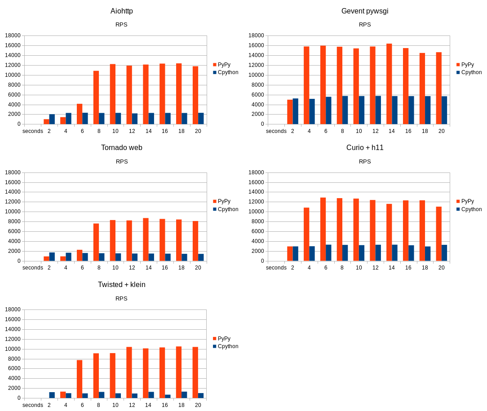
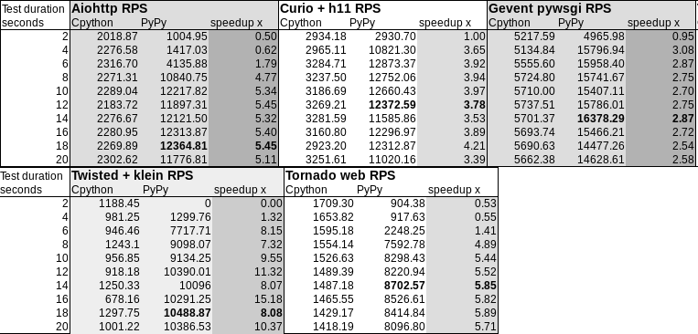

# Asynchronous HTTP libraries benchmark for upcoming PyPy release

For the accompanying blog post please see ...

Prerequisites
-------------

A working Linux x86_64 distribution, preferably Ubuntu if you don't wanna
build PyPy preview yourself. CPython 3.5 installed and PyPy build from 3.5 nightly.
Everything else is vendored in the repository.


Results
-------





Reproducing
-----------

The repository contains scripts to start the servers and run wrk several times
against them. Each script will print a couple of dots while it's working and display a line with results in RPS separated by commas at the end.

If you prefer running wrk manually you should do so with:

`vendor/wrk http://localhost:8080 -t 1 -c 100 -s zenhttp.lua`

The exact commands are given below:

```

pypy_nightly=~/pypy-c-jit-90326-88ef793308eb-linux64/bin/pypy3
python3 -m perfkit python zenhttp_aiohttp.py wrk --script zenhttp.lua --repeat 10
python3 -m perfkit python --binary "$pypy_nightly" zenhttp_aiohttp.py wrk --script zenhttp.lua --repeat 10

python3 -m perfkit python zenhttp_curio_h11.py wrk --script zenhttp.lua --repeat 10
python3 -m perfkit python --binary "$pypy_nightly" zenhttp_curio_h11.py wrk --script zenhttp.lua --repeat 10

python3 -m perfkit python zenhttp_gevent.py wrk --script zenhttp.lua --repeat 10
python3 -m perfkit python --binary "$pypy_nightly" zenhttp_gevent.py wrk --script zenhttp.lua --repeat 10

python3 -m perfkit python zenhttp_tornado.py wrk --script zenhttp.lua --repeat 10
python3 -m perfkit python --binary "$pypy_nightly" zenhttp_tornado.py wrk --script zenhttp.lua --repeat 10

```
